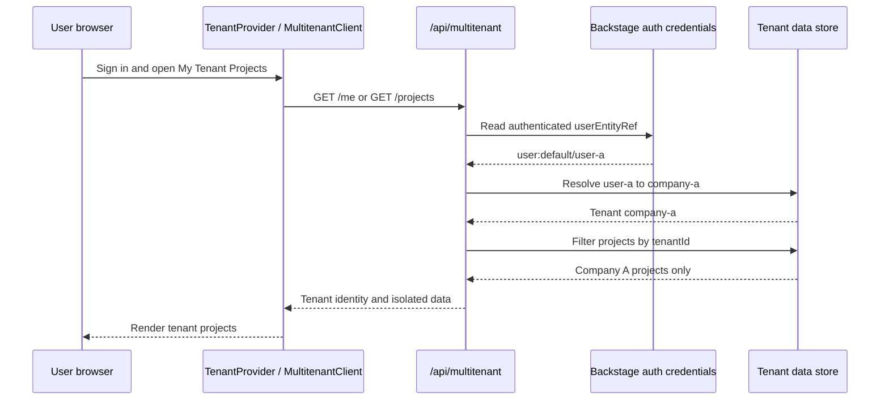

# Multi-Tenant Architecture

This repository implements a prototype multi-tenant flow for Backstage. A tenant is a company or organization. Every authenticated user is mapped to one tenant, and tenant-owned resources are filtered on the backend.

## Request Flow



## Backend

The backend plugin is registered in `packages/backend/src/index.ts` and exposes:

- `GET /api/multitenant/me`
- `GET /api/multitenant/projects`
- `GET /api/multitenant/projects/:id`

The route handler in `plugins/multitenant-backend/src/router.ts` performs these steps:

1. Requires Backstage user credentials through `httpAuth.credentials(req, { allow: ['user'] })`.
2. Reads the user's `userEntityRef` from the credentials.
3. Normalizes development and staging namespaces to `user:default/...`.
4. Extracts the user name and resolves it through `USER_TENANT_MAP`.
5. Returns `403` when the user is guest or has no mapping.
6. Filters list results by `project.tenantId`.
7. Checks the tenant again for single-project requests and returns `403` on cross-tenant access.

The current data is an in-memory prototype in `plugins/multitenant-backend/src/tenantData.ts`:

```ts
USER_TENANT_MAP = {
  'user-a': 'company-a',
  'user-b': 'company-b',
};
```

Each resource carries its tenant ownership explicitly:

```ts
{ id: 'project-a-1', name: 'Payment Service', tenantId: 'company-a' }
```

## Frontend

`TenantProvider` is mounted around the app in `packages/app/src/App.tsx`. It:

- Stores the selected tenant in `localStorage` under `backstage.activeTenantId`.
- Exposes the active tenant through `useTenant()`.
- Applies tenant-specific navigation visibility rules.
- Keeps `tenantIdBridge.current` synchronized for the API client.

`MultitenantClient` calls the backend through Backstage discovery and `FetchApi`. `FetchApi` supplies the user's authorization token automatically.

The demo `TenantSwitcher` sends the selected tenant as an `X-Tenant-ID` header. The backend accepts that header only when it matches a known tenant, then logs the authenticated user's real tenant and marks the response with `demoOverride: true`.

Changing the tenant causes `TenantProjectsPage` to refetch `/me` and `/projects`, so the displayed organization and project list change together.

## Example Requests

Authenticated as `user-a`:

```http
GET /api/multitenant/me
Authorization: Bearer <backstage-token>
```

Response:

```json
{
  "userEntityRef": "user:default/user-a",
  "tenantId": "company-a",
  "tenantDisplayName": "Company A",
  "demoOverride": false
}
```

List resources for the resolved tenant:

```http
GET /api/multitenant/projects
Authorization: Bearer <backstage-token>
```

A request by Company A for `project-b-1` returns `403`, even if the project ID is known. This is the important isolation check: authorization is based on the resource's `tenantId`, not only on whether the resource exists.

## Adding a Tenant or User

1. Add the tenant to `TENANTS` in `plugins/multitenant-backend/src/tenantData.ts`.
2. Add the user-name-to-tenant mapping in `USER_TENANT_MAP`.
3. Add the same tenant to `AVAILABLE_TENANTS` in `plugins/multitenant/src/context/TenantContext.tsx` if it should appear in the demo switcher.
4. Add navigation rules to `TENANT_NAV_CONFIG` when the tenant needs different sidebar visibility.
5. Assign every new tenant-owned resource exactly one `tenantId`.
6. Add backend tests for own-tenant access and cross-tenant denial.

For GitHub users, the mapping key is the name portion of the entity ref created by the sign-in resolver. The backend logs and `/api/rbac-backend/me` can be used to identify that value.

## Security Notes

The authenticated user's tenant is the authoritative value for production authorization. The `X-Tenant-ID` header and the switcher are demo conveniences and must not be treated as a client-controlled authorization mechanism in a production deployment. A production implementation should:

- Store tenant membership and tenant definitions in a database.
- Resolve membership from the authenticated identity on the server.
- Apply tenant predicates to every tenant-owned database query.
- Enforce tenant checks in update and delete operations as well as reads.
- Keep cross-tenant tests for every resource endpoint.
- Decide explicitly whether users may belong to multiple tenants and model that relationship rather than accepting arbitrary tenant IDs.

## Verification

The backend tests cover user isolation, guest and unknown-user denial, unauthenticated requests, and cross-tenant project access:

```bash
yarn workspace @internal/backstage-plugin-multitenant-backend test
```
